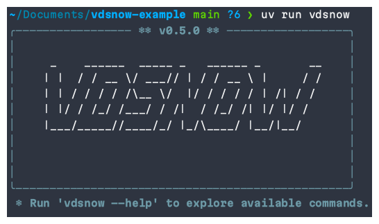
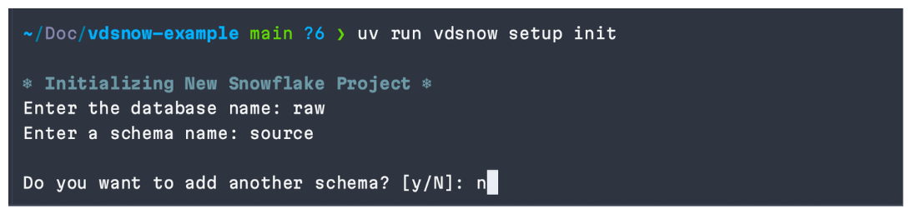
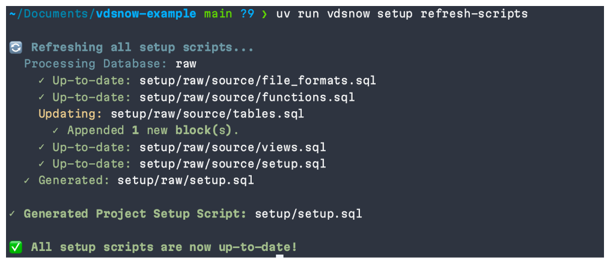
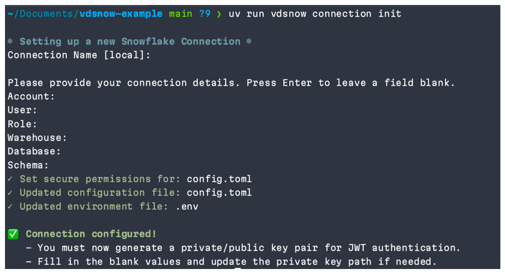
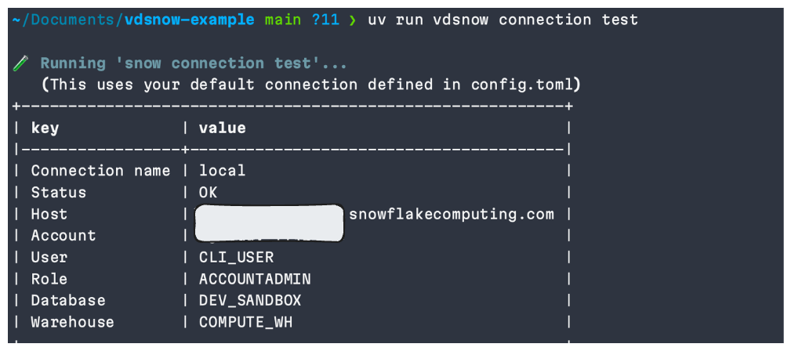
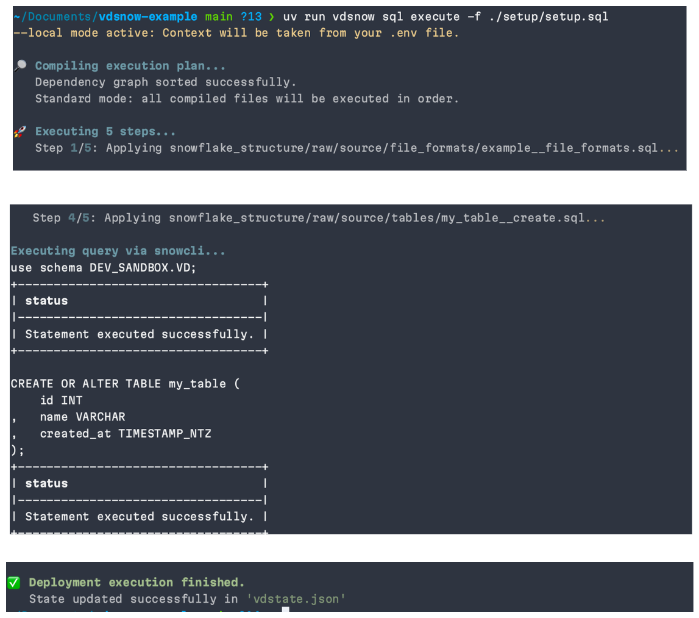
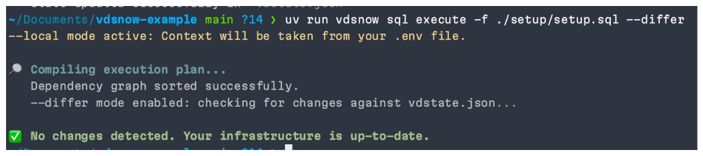
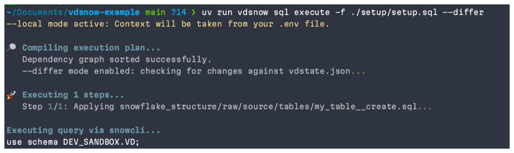
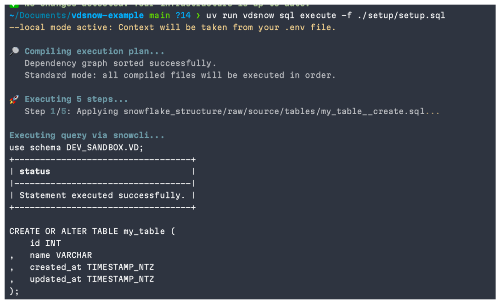
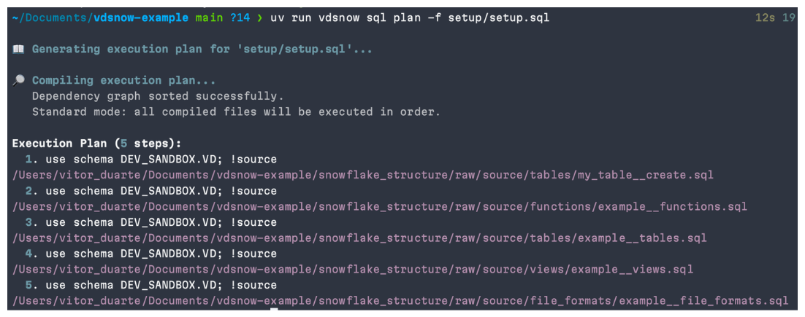

In this tutorial, we will learn how to use the vdsnow python package that wraps the snowflake cli and helps you managing your snowflake resources. For more information, please visit the [vdsnow documentation](https://pypi.org/project/vdsnow).

## Snowflake Setup

I'm using a snowflake trial account. Everything that you need to setup is documented in sf.sql. I've kept this very simple for demo purposes.


## Installation

In this walk through, we will use uv as a dependency manager to install vdsnow. To initialize the project, run the following command (ensure that you have uv installed [uv](https://docs.astral.sh/uv)):

```bash
uv init my-project && cd my-project
```

Now let's add / install vdsnow:

```bash
uv add vdsnow
```

In order to test vdsnow:

```bash
uv run vdsnow
```

We should see a banner with the version of vdsnow:



## Setup Snowflake Folder Structure

To work with `vdsnow` features, you must initialize the two main folders `snowflake_structure` and `setup`. You can do this by running the following command:

```bash
uv run vdsnow setup init
```

You will be prompted to enter Snowflake details such as database name and schemas under the database.


If we need to add a new database and respective schemas, we can use the following command (we will be prompted as above):

```bash
uv run vdsnow setup add_database
```

If we need to add a new schema to an existing database, we can use the following command (we will be prompted as above) - This demo is using database = raw and schema = source:

```bash
uv run vdsnow setup add-schema <db> --schema new_schema_name --schema new_schema_name2
```

Note that when initializing your `snowflake_structure`, vdsnow creates 4 folders under a schema:
- `file_formats`
- `functions`
- `tables`
- `views`
These are snowflake objects commonly used in data engineering and analytics projects. Inside each folder, an example .sql file is also created. Obviously, you can modify/rename/delete these files to fit your needs/real snowflake structure. I will keep them for demo purposes.


### Creating a new object
Let's simulate creating a new object, a snowflake table.

```bash
touch ./snowflake_structure/raw/source/tables/my_table__create.sql
```

Table's DDL:

```sql
CREATE OR ALTER TABLE my_table (
    id INT
,   name VARCHAR
,   created_at TIMESTAMP_NTZ
);
```

#### Setup Folder
./setup/ aims to group together all the setup scripts for your Snowflake environment. This means that inside a database/schema, objects will be grouped together. E.g. all tables in `raw/source/tables/*.sql` will be grouped in `./setup/raw/source/tables.sql`.

If you haven't added any new object yet, you will see in only the example file listed in `./setup/raw/source/tables.sql`:

```
-- FILE: example__tables.sql
!source ./snowflake_structure/raw/source/tables/example__tables.sql
```

Then, any setup.sql (we're project must have multiple setup.sql files) actually groups object together by schema and by database. So ./setup/raw/source/setup.sql groups all objects inside the **source** schema; ./setup/raw/setup.sql groups all schemas inside the **raw** database; finally, ./setup/setup.sql groups all databases inside your account account.

As you may've noticed, the setup.sql files are executed in alphabetical order. This means that if you have a dependency between two objects, you should order them accordingly. For example, if you have a table that depends on a view, the view should be created before the table (later on, we talk about dependency management).

Well, at this point, we can create a new table in the `raw/source/tables` (my_table__create.sql), but it's not automatically added into ./setup/raw/source/tables.sql. An option is refreshing your ./setup folder, by running:

```bash
uv run vdsnow setup refresh-scripts
```

This command makes a full-refresh of the setup scripts. The output message indicates either the <object>.sql file is up-to-date or has been updated. Example, after running the command, you will see that ./setup/raw/source/tables.sql has been updated:



Obviously, we could've done it manually, by adding the following line to ./setup/raw/source/tables.sql:

```
-- FILE: tables.sql
!source ./snowflake_structure/raw/source/tables/my_table__create.sql
```

After that, your ./setup/raw/source/table.sql should look as follows:

```
-- FILE: example__tables.sql
!source ./snowflake_structure/raw/source/tables/example__tables.sql

-- FILE: my_table__create.sql
!source ./snowflake_structure/raw/source/tables/my_table__create.sql
```

Ps. These comments are irrelevant, but we recommend having them.

#### Folder Structure Validation

In order to validate the folder structure, you can run the following command:

```bash
uv run vdsnow check folder-structure
```

This command validates the project structure for discrepancies. It raises an error if a file is listed to be deployed (inside ./setup) but it's not found in ./snowflake_structure. It raises a warning if a file is defined in ./snowflake_structure but it's not found in ./setup.


## Setup Snowflake Connection

Before executing the setup scripts, you need to configure your Snowflake connection. You can do this by running:

```bash
uv run vdsnow connection init
```

You will be prompted to enter your Snowflake connection name, followed by your account details. Once you've entered them, a .env file as well as a config.toml are created.



**Note:** We recommend to enter a SANDBOX database and a DEV_SANDBOX schema for local development.

By default, vdsnow creates two connections (config.toml), a local one (named `local`), which you may change its name later, and a remote one (named `headless`), which the name should not be changed.

You can modify (manually) both files to suit your needs. For instance, if you use a different type of authentication, you may change this parameter in both files. **import** config.toml must only contain the parameters but their values should be empty - that's a snowcli requirement (they are overwritten by the environment variables).

After ensuring the your connection details are correct, you can source your .env file and test your connection by running:

```bash
source .env
uv run vdsnow connection test
```

You will see your connection details - meaning that your connection has been well established:



## Running Scripts
Now that we've got your connection established and we've got something to be run/tested/deployed (locally), we can run the `vdsnow sql execute` command. In this walk-through we will only use the -f flag, which allows you to point to a file containing your SQL script (it must be a valid path). As it's the first time that we're running something, we will deploy/run/execute ./setup/setup.sql, which runs every single SQL statement definied in setup/:

```bash
uv run vdsnow sql execute -f ./setup/setup.sql
```

As you might notice, the command investigates the file you provided and parses it, creating a execution plan. Note that by default the 'local' mode is used and the context (database.schema) is always set as the first statement of the file. It is done automatically and makes sure that the context is set correctly and we can work with relative object names.

In the above example, 5 files were identified to be executed, as we can see, the new table was there.



By default, when the execute command is run, vdsnow generates a vdstate.json file, which contains relevant information about the executed SQL statements. This file can be also used to differ old vs new deployments. So, if we re-run above command, but now passing the --differ flag, nothing will be deployed/run/executed.

```bash
uv run vdsnow sql execute -f ./setup/setup.sql --differ
```



Now let's simulate a change. Let's add a new column into my_table. So, in ./snowflake_structure/raw/source/tables/my_table__create.sql:

```sql
CREATE OR ALTER TABLE my_table (
    id INT
,   name VARCHAR
,   created_at TIMESTAMP_NTZ
,   updated_at TIMESTAMP_NTZ --> NEW COLUMN
);
```

Running the execute command with the --differ flag enabled, we will see that 1 object is listed to be executed.

```bash
uv run vdsnow sql execute -f ./setup/setup.sql --differ
```



The differ flag may be very useful while deploying snowflake objects that don't have CREATE OR ALTER statement available.


### Managing Dependencies

Let's suppose something completely hypothetical - a file format that depends on a table. So, the table needs to be deployed before the file format. In order to achieve this, we can use a special comment in our .sql file: -- vdsnow_depends_on: ../tables/my_table__create.sql. Therefore, let's update ./snowflake_structure/raw/source/file_formats/example__file_formats.sql

```sql
-- This file depends on a table in the same schema (source).
-- The path is relative to this file's location.
-- vdsnow_depends_on: ../tables/my_table__create.sql
SELECT CURRENT_DATE() AS DATE;
```

If you run the execute command now, you will see that execution order has changed, having the table statement executed first.

```bash
uv run vdsnow sql execute -f ./setup/setup.sql
```



Note the vdstate.json has also been updated with the new dependency (have a look at the file).

### Plan
```
uv run vdsnow sql plan -f setup/setup.sql
```

- **Plan**: Print the execution plan for the SQL statements. It can be combined with the --no-local flag if we want to understand what will be executed in headless/remote/destination database.


Note that the plan is also updated with the new dependency (table created prior the file format).

### Remote State

By default, vdsnow stores vdstate.json in a snowflake internal stage. That's important to manage deployments and ensure consistency across environments. You're able to upload this file if it already exists in the stage.

If you want to download the file, you can use the following command - provide the database and schema where the stage is located:

```bash
uv run vdsnow sql get-state-from-remote --db <database> --schema <schema>
```

It may be useful for debugging purposes or understanding the current state.

## CI/CD

A CI and CD workflow file is definied in [here - ci](./.github/workflows/ci.yml) and [here - cd](./.github/workflows/cd.yml) and can be used as a guide for your CI/CD pipeline's needs.

For the CI process, if you want to reproduce this kind of approach, you can use the following command:

```bash
uv run vdsnow setup create-ci
```

This command creates a ci folder inside setup/, which will be used in the CI process.


## Auditability

vdsnow also comes with auditability features, which include tracking changes, versioning, and auditing of data modifications. These features help ensure data integrity and compliance with regulatory requirements. Whenever a vdsnow sql execute command is executed against the destination database, the changes are tracked and logged for auditing purposes into a logging table.

## Other commands
```bash
uv run vdsnow sql refresh-state # Whenever you want to refresh vdstate.json file
```
```bash
uv run vdsnow sql execute -q "SELECT 'Hello World'" <--local/--no-local> # Execute sql query. --local/--no-local flag is always available for sql commands, if not specified, it will check an env var.
```

## Final Notes

We do encourage you to use vdsnow in your projects and contribute to its development. Your feedback and contributions are highly appreciated. Rememeber that vdsnow is just a wrapper of snow (snowcli), therefore feel free to combine snow and vdsnow together.

My goal with vdsnow is to always include new features and use cases that I face with Snowflake, for that reason, one more time, your feedback is highly appreciated!!
